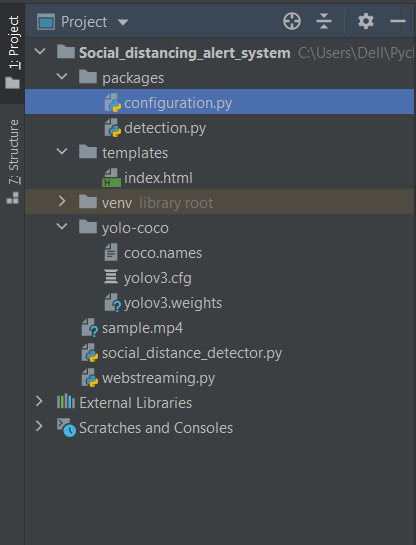
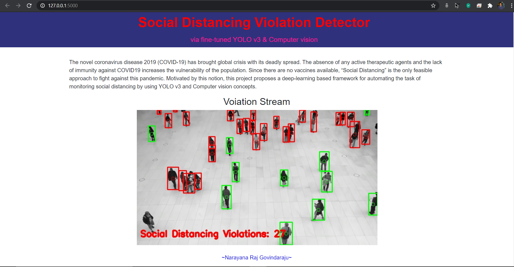

# Social-Distancing-Alerting-System
> via fine-tuned YOLO v3 and Computer vision

## Project Summary:
COVID-19 spread is emotionally challenging for many people, changing day-to-day life in unprecedented ways. All sections of society should play a vital role to protect themselves and each other and help prevent further spread of the disease. Social-distancing is an important way to slow down the spread of infectious diseases. People are asked to limit their interactions with each other, reducing the chances of the disease being spread with physical or close contact.  

The solution is to create a system that uses pre-installed cameras/ recorded videos to analyze images from public areas like shopping malls, streets to see whether the public is adhering to safety measures, like maintaining social distancing.  

This project uses python combined with deep learning and computer vision to monitor social distancing. A web application is built which streams the video of  Social distancing Violations.  

In this project, I am using Yolo object detection so all the files regarding Yolo configuration should be properly organized. The project structure should be as the following image.  

Inside the main folder create a **package** folder which contains the following python files:
> **detection.py**:  

This .py file contains people detection code using the YOLO algorithm. we will be importing this code in the main social distancing code to detect people in the image frame.  

> **configuration.py**: 

This file contains all the necessary thresholds and constants required for social distancing detection.

Create another folder called **yolo-colo** which includes all the pre-trained YOLO files.  
In the below link you can download the **Cfg** and **Weights** files and move it to yolo-coco folder:  
https://pjreddie.com/darknet/yolo/  

Can use the below video and save it as **sample.mp4**  
https://www.youtube.com/watch?v=WvhYuDvH17I&feature=youtu.be  

In the configuration file, if we have GPU capable graphic card with Cuda installed, declare **USE_GPU** variable to **True** otherwise make it as false, this is to speed up the detection or make use of Google Colab.  
Follow the below tutorial to install Cuda,  
https://towardsdatascience.com/installing-tensorflow-with-cuda-cudnn-and-gpu-support-on-windows-10-60693e46e781  

The **social_distance_detector.py** file detects and monitors the social distancing violations.  

Finally, build a web application that is integrating all the files that we have created.  

Create a python file named **webstreaming.py** and a **templates** folder which contains **index.html** file.  

A UI is provided for where the live stream/ video stream of social distancing violations are showcased on webpage.  
The UI will look like the following image:  

  

The final Flask application can be hosted on the cloud or any server like pythonanywhere.  

## Useful Links:
https://www.simplilearn.com/tutorials/deep-learning-tutorial/what-is-deep-learning
https://medium.com/@jonathan_hui/understanding-feature-pyramid-networks-for-object-detection-fpn-45b227b9106c
https://www.pyimagesearch.com/2017/11/06/deep-learning-opencvs-blobfromimage-works/
